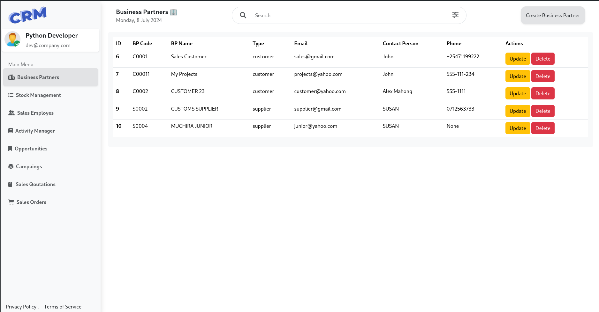
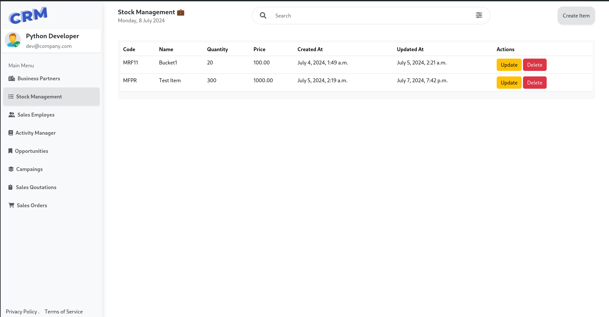
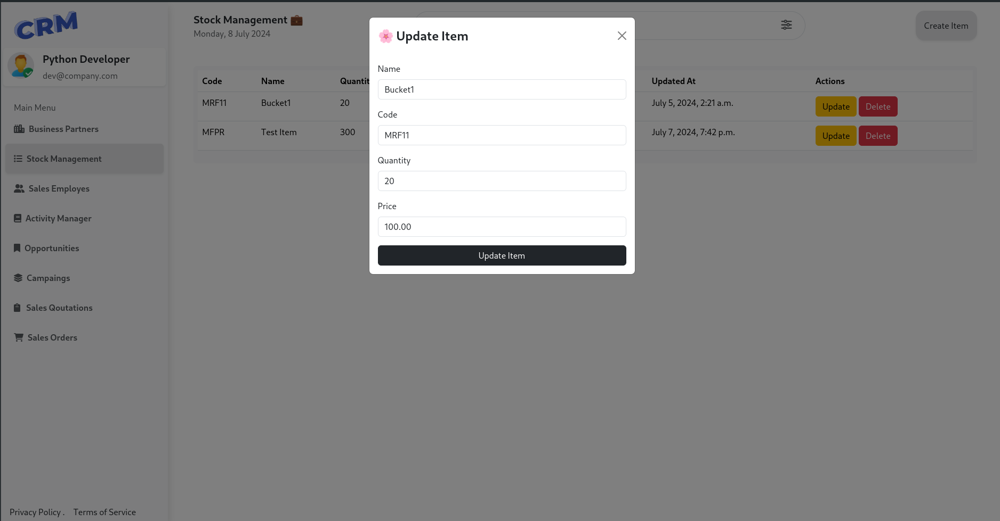
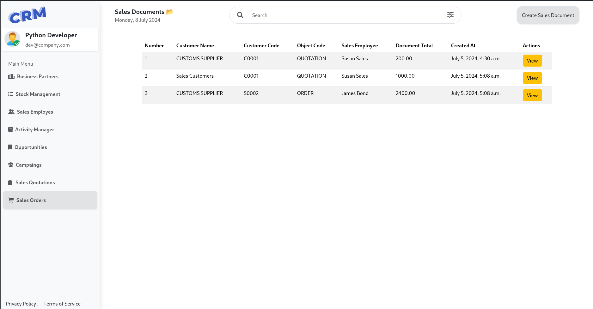
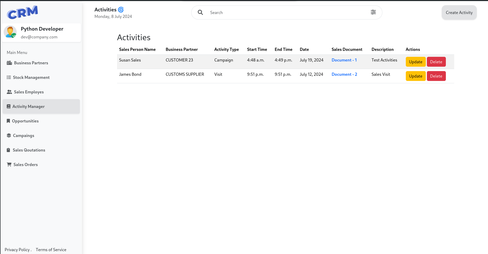
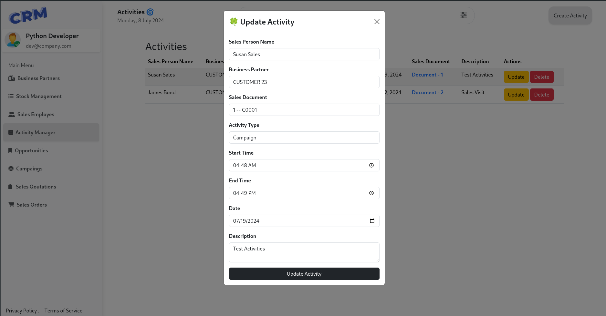
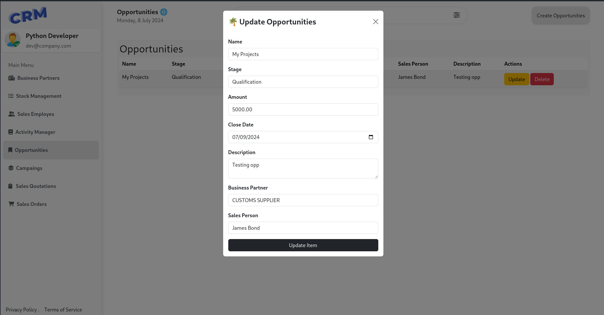
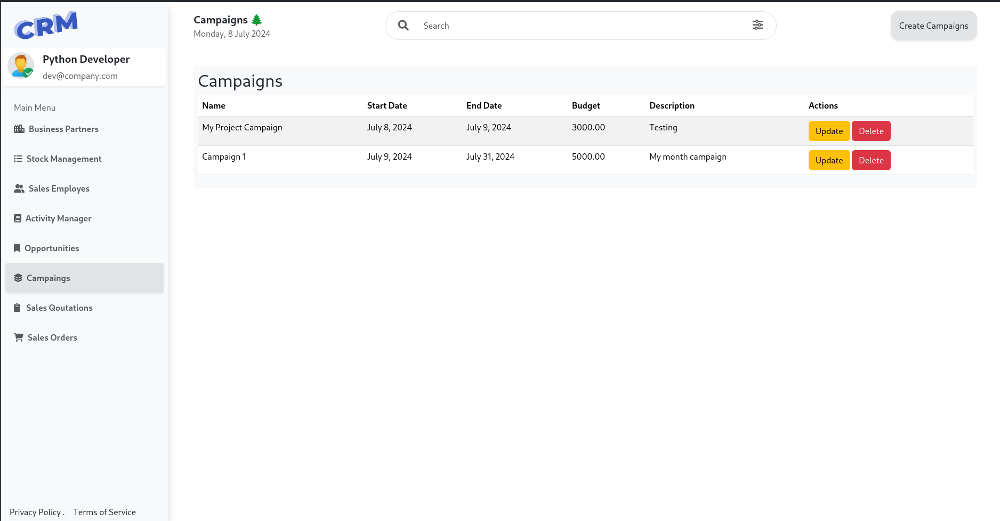

# CRM Project


## Overview

This CRM (Customer Relationship Management) project is designed to manage various aspects of sales and customer interactions. It includes modules for managing items, sales documents, activities, business partners, opportunities, campaigns, and more.

### Features

- **Business Partners:** Manage customer, supplier, and partner information with detailed contact and address details.


- **Item Management:** CRUD operations for managing items, including name, code, quantity, and price.



- **Sales Document:** Create, view, and manage sales documents, associating them with customers and salespeople.


- **Activity Tracking:** Track activities such as phone calls, meetings, and campaigns associated with business partners.



- **Opportunities:** Track sales opportunities, including stage, amount, expected close date, and associated business partners.




- **Campaigns:** Plan and track marketing campaigns to manage customer engagement and lead generation.



## Setup

### Prerequisites

- Python 3.x
- Django 3.x
- PostgreSQL (or SQLite for development)

### Installation

1. Clone the repository:

   ```bash
   git clone https://github.com/muchirajunior/crm.git
   cd crm
   ```

2. Create and activate a virtual environment:

   ```bash
   python3 -m venv env
   source env/bin/activate  # On Windows use `env\Scripts\activate`
   ```

3. Install dependencies:

   ```bash
   pip install -r requirements.txt
   ```

4. Apply database migrations:

   ```bash
   python manage.py migrate
   ```

5. Load initial data (if any):

   ```bash
   python manage.py loaddata initial_data.json
   ```

6. Start the development server:

   ```bash
   python manage.py runserver
   ```

7. Access the application at `http://localhost:8000`.

## Usage

- Navigate through different modules using the sidebar navigation.
- Use CRUD functionalities to manage items, sales documents, business partners, activities, opportunities, and campaigns.
- Add or update records as necessary, ensuring data accuracy and completeness.
- Monitor sales documents, activities, and opportunities to track progress and manage customer relationships effectively.

## Contributing

Contributions are welcome! Please fork the repository and submit pull requests to contribute new features, improvements, or fixes.

## License

This project is licensed under the MIT License - see the [LICENSE](LICENSE) file for details.


